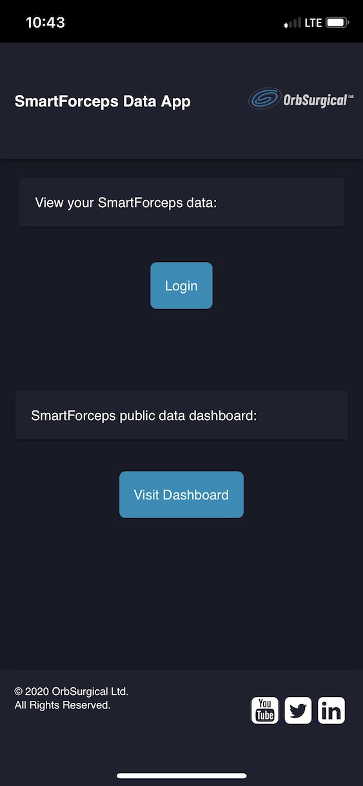

# SmartForceps PWA
The SmartForceps program as a Progressive Web App



## What It Is

A PWA that provides Login gateway to SmartForceps data app utilizing an app manifest, service workers and caching. This app is written in plain-vanilla HTML, CSS and Javascript (ES6). It has no dependencies.

## To Test This Out
1. Open your terminal (NOTE: git bash preferred/ Terminal on VS Code)
2. Navigate to the project folder where you have cloned this repo.
3. Type the following command in the terminal
     ```
     yarn add serve
     yarn serve
     ```
4. Visit the localhost to see your PWA in action. 

## Browser Compatibility

Hello PWA has been tested in the following browsers:

* Chrome 67 (Windows and Android)
* Firefox 60
* Safari 11
* Edge 42
